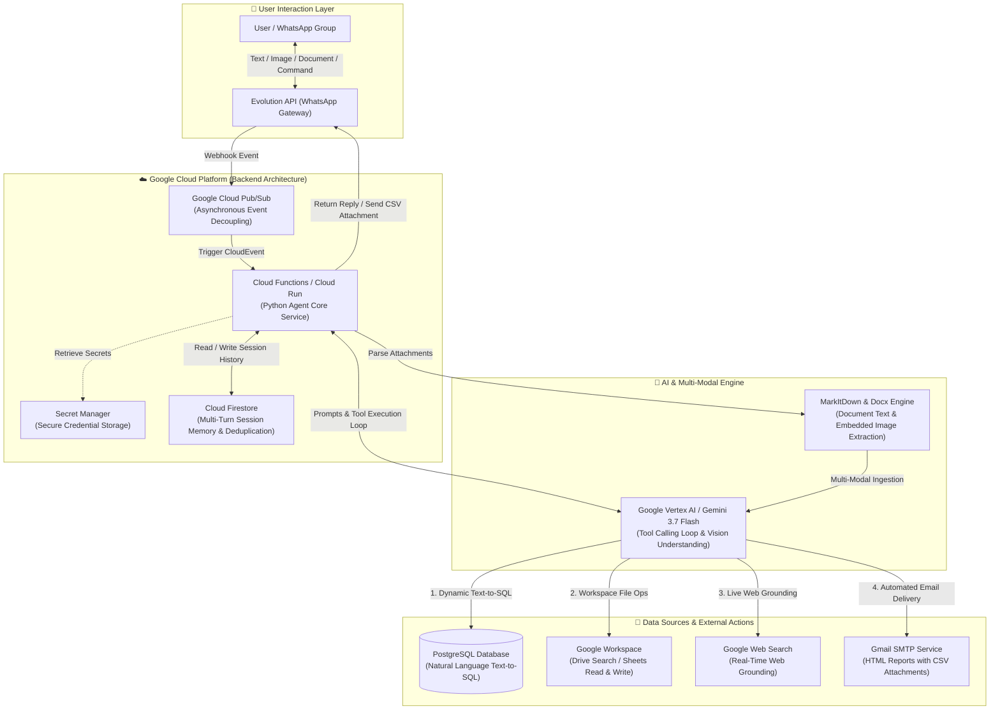
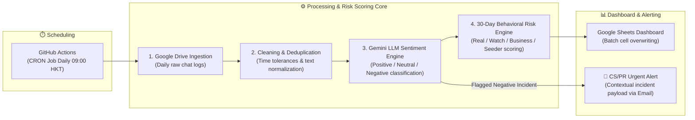

# 🚀 AI-Driven Business Operations & Marketing Intelligence Suite

> **An enterprise AI operations portfolio** integrating real-time Generative AI assistants with automated data pipelines. Built to eliminate manual daily workflows, unlock conversational data insights, and proactively detect brand sentiment and community risks.

**English** | [繁體中文版](README_zh.md)

---

## 📌 Executive Summary

This repository demonstrates the end-to-end implementation of **Generative AI (Gemini 3.7 Flash)** and **Google Cloud Platform (GCP)** architecture in real-world business operations. The solution consists of two complementary systems:

1. **🤖 Multi-Modal WhatsApp AI Operations Assistant (Real-Time)**: An on-demand conversational agent deployed on GCP. Non-technical staff can query databases via natural language, extract data from documents/images, and dispatch CSV/email reports directly within WhatsApp.
2. **📊 Marketing Intelligence & Risk Profiling Pipeline (Automated Batch)**: An autonomous data pipeline running scheduled jobs to clean chat logs, profile community users, analyze brand sentiment, and trigger instant crisis alerts for customer service teams.

---

## 🤖 System 1: Multi-Modal WhatsApp AI Operations Assistant

### 🎥 Live Demo
<!-- Place your GIF file in the assets/ directory -->

### 🏗️ Cloud & Agent Architecture

### 🧪 Verified Capabilities & Test Scenarios

The system has undergone end-to-end verification across operational workflows:

* **Test 1: Multi-Turn Memory & Session Reset (`/reset`)**
  * **Workflow:** Verified contextual memory across conversations stored in Cloud Firestore.
  * **Result:** Agent recalls contextual user attributes (e.g., user identity) and cleanly wipes history upon issuing `/reset`.
* **Test 2: Natural Language Database Querying (Text-to-SQL)**
  * **Workflow:** Inspects database schemas dynamically and executes safe read-only `SELECT` queries with connection pooling (SQLAlchemy).
  * **Result:** Automatically queries message counts and timestamps, displaying real-time UI feedback (`🔍 Executing SQL...`) before outputting structured insights.
* **Test 3: Big Data Analysis & Physical File Delivery**
  * **Workflow:** Extracts datasets into temporary storage, performs LLM sentiment/categorization analysis, and compiles downloadable reports.
  * **Result:** Delivers real-time progress indicators (`🧠 Analyzing data... ➔ 📊 Packaging report...`) and pushes the physical `.csv` file directly into the WhatsApp chat window.
* **Test 4: Multi-Modal & Document Understanding (Images & Files)**
  * **Workflow:** Evaluates image OCR and multi-format document parsing (`.docx`, `.xlsx`, `.pdf`, `.pptx`).
  * **Result:** Successfully extracts text and embedded flowcharts/screenshots inside documents, combining visual and textual reasoning into concise summaries.
* **Test 5: Automated Email Reporting with Attachments**
  * **Workflow:** Connects with Gmail SMTP to compile formatted HTML reports with data attachments.
  * **Result:** Pushes formatted executive summaries with generated `.csv` files directly to designated stakeholder inboxes.
* **Test 6: Real-Time Web Grounding Search**
  * **Workflow:** Dispatches queries requiring external real-time data (e.g., live exchange rates, financial news) using a dedicated Google Grounding client.
  * **Result:** Accurately summarizes live web data without conflicting with internal tool schemas.
* **Test 7: Group Mention Filtering & Idempotency (Production Guardrail)**
  * **Workflow:** Filters non-relevant group messages and avoids duplicate executions from Pub/Sub retries.
  * **Result:** Agent remains silent unless explicitly `@mentioned` in groups; Firestore-backed deduplication ignores duplicate message IDs.

---

## 📊 System 2: Automated Sentiment & Community Risk Profiling Pipeline

### 🏗️ Pipeline Architecture

### 🌟 Key Functional Capabilities

* **🧠 Granular Sentiment & Crisis Alerting:** Scans daily brand discussions and flags urgent negative feedback (attaching chat group, sender phone, timestamp, and quoted messages) to customer service teams.
* **🛡️ 30-Day Historical Risk Profiling:** Tracks cross-group engagement history over 30 days to tag accounts into *Real User*, *Watchlist*, *Commercial Spammer*, or *Competitor Seeder*.
* **📈 Zero-Touch Executive Dashboards:** Automatically aggregates volume, sentiment distribution, and topic trends, updating management dashboards with zero manual intervention.

---

## 💼 Business Impact & Efficiency Gains

| Metric / Dimension | Traditional Manual Workflow | AI-Automated Solution | Impact & Value Added |
| :--- | :--- | :--- | :--- |
| **Daily Data Processing** | 2 – 3 Hours / day | ~15 Minutes / day | **>80% Operational Time Saved** |
| **Data Querying Barrier** | Relies on data/IT team requests | Instant via WhatsApp conversation | **Zero learning curve** for non-technical teams |
| **Crisis Detection** | Discovered passively after complaints | Automated daily morning email alerts | Enables **proactive PR & CS intervention** |
| **Community Quality** | Manual review of spam accounts | Automated 30-day behavior profiling | Protects organic community trust |

---

## 🛠️ Technology Stack

* **AI & Multi-Modal Frameworks:** Google Vertex AI (Gemini Flash), MarkItDown, Python-docx, Prompt Engineering
* **Cloud & Serverless:** Google Cloud Platform (Cloud Functions, Cloud Run, Cloud Pub/Sub, Cloud Secret Manager, Cloud Firestore)
* **Data & Storage:** PostgreSQL, SQLAlchemy (Connection Pooling), Pandas
* **Automation & Gateways:** Evolution API (WhatsApp Gateway), Google Workspace APIs (Sheets & Drive), Gmail SMTP, GitHub Actions

---

## 🔒 Security & Privacy Notice

* **Encrypted Secrets:** All credentials, database URIs, and API tokens are managed via GCP Secret Manager and GitHub Secrets.
* **De-Identified Data:** All demonstration logs, database schemas, and media samples are sanitized for public presentation.
