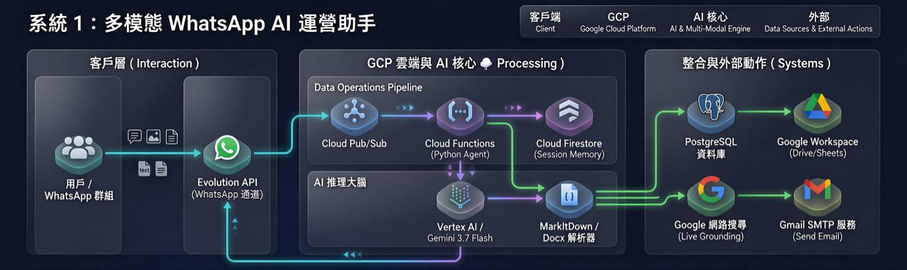
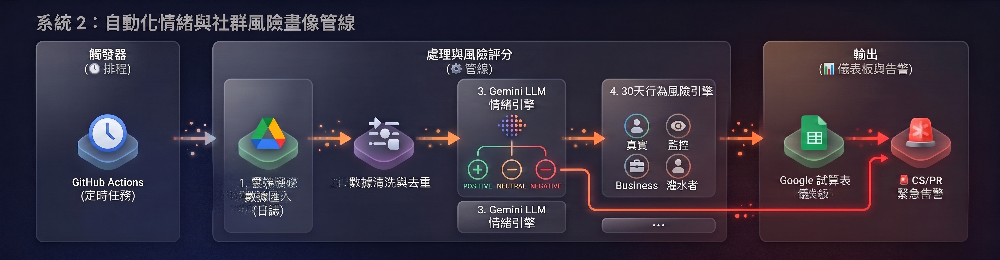

# 🚀 AI 數智營運與市場情報自動化系統 (AI-Driven Operations Suite)

> **雙軌企業級 AI 營運賦能專案**：結合即時生成式 AI 助理與自動化數據管線，旨在消除重複性人工日常作業、實現對話式數據提取，並主動監控社群品牌輿情與帳號風險。

[English](README.md) | **繁體中文**

---

## 📌 專案總覽 (Executive Summary)

本專案展示了如何將 **生成式 AI（Gemini 3.7 Flash）** 與 **Google Cloud Platform (GCP) 雲端架構** 實際落地於日常商業營運。全套解決方案包含兩大互補的核心系統：

1. **🤖 WhatsApp 多模態 AI 營運小幫手（即時互動）**：部署於 GCP 雲端的智慧營運助理。團隊非技術同仁只需透過日常 WhatsApp 對話，即可直接以自然語言查詢資料庫、解析多格式文件與圖片，並一鍵產出實體報表或寄送 Email。
2. **📊 社群輿情分析與用戶風控數據管線（定時批次處理）**：全自動化數據處理流程，每日定時清洗社群日誌、對用戶進行 30 天行為風控評級、追蹤品牌情緒，並在發現公關危機時主動向管理與客服團隊發出警報。

---

## 🤖 系統一：WhatsApp 多模態 AI 營運小幫手
### 🏗️ 雲端與智能體架構圖 (Architecture)

### 🧪 核心功能與實戰測試場景 (Verified Test Scenarios)

本系統已通過完整的功能驗證測試，涵蓋各項日常營運應用：

* **測試 1：多輪記憶與會話重置（Session & Reset）**
  * **測試內容：** 驗證 Cloud Firestore 的會話持久化記憶與重置指令。
  * **實測結果：** Agent 能在多輪對話中精準記憶用戶屬性（如姓名與歷史背景），收到 `/reset` 後即時清空上下文記憶。
* **測試 2：資料庫唯讀查詢與結構解析（Text-to-SQL）**
  * **測試內容：** 驗證連線池（Connection Pool）、Schema 解析與 SQL 執行。
  * **實測結果：** 自動調用 `get_database_schema` 解析大小寫駝峰欄位，發送查詢進度提示（`🔍 正在為您執行 SQL...`）後精準輸出查詢結果。
* **測試 3：巨量數據分析與實體報表發送（Big Data & Send File）**
  * **測試內容：** 驗證數據暫存 CSV、LLM 深度營運分析及 WhatsApp 傳送實體檔案。
  * **實測結果：** 系統依序呈現進度通知（`🧠 正在進行深度智能分析... ➔ 📊 正在打包並發送檔案...`），並直接在 WhatsApp 視窗回傳 `.csv` 實體檔案與文字總結。
* **測試 4：多模態與各式文件解析（Multimodal & Documents）**
  * **測試內容：** 驗證圖片 OCR、Word（含內嵌截圖）、PDF、Excel 解析能力。
  * **實測結果：** 成功解析圖片與檔案內容，自動提取 Word 內嵌之流程圖/截圖交由視覺模型總結關鍵 SOP。
* **測試 5：電子郵件自動發送與附件寄送（Email Tool）**
  * **測試內容：** 驗證 Gmail SMTP 寄信與帶附件能力。
  * **實測結果：** 發送進度提示（`✉️ 正在整理報告內容並寄出...`），並將排版完整的 HTML 報告與實體 `data_report.csv` 附件寄送至指定信箱。
* **測試 6：聯網搜尋與即時資訊（Google Web Search）**
  * **測試內容：** 驗證獨立 Grounding 搜尋客戶端是否避開工具衝突。
  * **實測結果：** 成功檢索最新即時匯率、外部市場新聞，並回傳結構化摘要。
* **測試 7：群組 @Mention 喚醒與防重複消費（Idempotency & Group Filter）**
  * **測試內容：** 驗證群組防打擾與 Pub/Sub 重複推送防護（生產環境安全機制）。
  * **實測結果：** 群組中未 `@機器人` 時保持靜默；Firestore 冪等機制自動攔截重複的 Message ID，防止重複觸發。

---

## 📊 系統二：自動化社群輿情與風險帳號畫像分析管線

### 🏗️ 數據管線架構圖 (Pipeline Architecture)

### 🌟 核心功能亮點

* **🧠 智能情緒辨識與公關危機預警：** 自動分類顧客反饋，鎖定負面情緒客訴，即時提取群組、發送時間、發言者電話與引用內容，向客服團隊寄送緊急告警。
* **🛡️ 30 天用戶行為軌跡與風險畫像：** 回溯 30 天跨群發言頻率，自動評分並標記帳號類型（*真實用戶 Real*、*觀察名單 Watch*、*商業廣告號 Business*、*競品暗樁號 Seeder*）。
* **📈 全自動零手動維護看板：** 每日自動匯總各群熱度與情緒佔比，透過 API 自動更新 Google 試算表儀表板。

---

## 💼 商業價值與量化成效 (Business Impact)

| 營運指標 / 環節 | 傳統人工處理模式 | 導入 AI 數智系統後 | 創造的商業價值 |
| :--- | :--- | :--- | :--- |
| **每日數據整理耗時** | 每日需花費 2 ～ 3 小時 | 縮短至約 15 分鐘 | **節省超過 80% 人工作業時間** |
| **業務數據獲取門檻** | 需向技術人員提需求等待匯出 | 隨時在 WhatsApp 提問即得 | **跨團隊溝通成本歸零**，決策更即時 |
| **公關客訴反應速度** | 被動發現或於數日後人工覆盤 | 每日主動掃描並寄出危機警報 | 搶先於第一時間**主動介入處理客訴** |
| **社群健康度維護** | 難以人工識別競品暗樁與洗版號 | 自動化 30 天行為評分標記 | 有效淨化社群品質，**維護真實用戶體驗** |

---

## 🛠️ 技術與工具應用 (Tech Stack)

* **AI 與多模態模型：** Google Vertex AI (Gemini Flash)、MarkItDown、Python-docx 文件多模態解析、提示詞工程 (Prompt Engineering)
* **雲端與無伺服器架構：** Google Cloud Platform (Cloud Functions、Cloud Run、Cloud Pub/Sub 事件驅動、Secret Manager 密鑰管理、Cloud Firestore 狀態儲存)
* **資料庫與數據處理：** PostgreSQL、SQLAlchemy（連線池管理）、Pandas、正則表達式
* **自動化流程與 API 串接：** Evolution API (WhatsApp 通道)、Google Workspace APIs (Sheets & Drive)、Gmail SMTP 郵件引擎、GitHub Actions 定時排程

---

## 🔒 數據隱私與安全性聲明 (Security & Privacy)

* **資安防護：** 所有資料庫連線字串、API Key 與服務憑證均採用雲端加密儲存（Secret Manager 及環境變數），絕不上傳至公開儲存庫。
* **去識別化展示：** 本專案展示之對話紀錄、資料庫欄位及演示數據均已進行嚴格的脫敏（De-identification）與模擬數據替換，無任何真實客戶隱私資料外洩。
